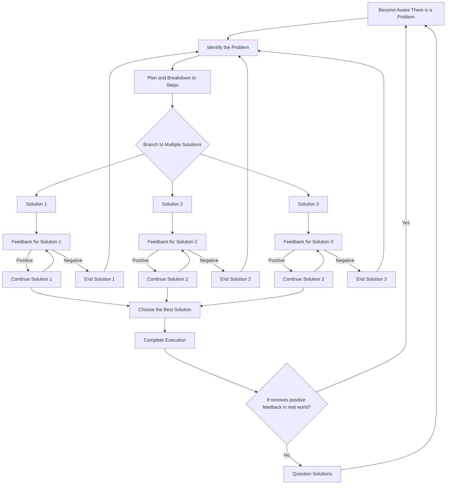

If you are a user of an operating system in any way, setting up a version control system (VCS) is highly recommended, though its application is not limited to just software developers. If you are new to the concept of VCS and GitHub, I would recommend checking out [this website](https://learngitbranching.js.org/) for an interactive learning session. TLDR, it is a way of checkpointing systems at a particular timestep so that you can undo mistakes, collaborate with multiple users in a single codebase, work on multiple features, and much more. But I noticed a striking similarity between the development workflow of using Git and the way humans perceive and solve problems. Commits, Branches, Remote Origin, Stashes, Stages, Reverts, Merges—all seem to play an important role in how we approach, analyze, plan, and execute problem-solving. So, is there a way to "solve problem solving"?

Here is a simple general decomposition of how a problem is solved by a human being:

Even this complex graph would not do justice to the complexity of problem solving humans undergo. But notice that the central theme common across the process is Iteration.

And the inherent property of iteration is the loops associated with it. Multiple simultaneous loops! And managing all of them with a sight of the end product and vision is multitasking at its limit. Hence, a system of documentation, storage, and management is essential. Use of note-taking apps such as Notion and Obsidian, project management apps such as Asana and ClickUp, and task management apps such as TickTick and Google Tasks are in popular use. But how will you manage all of them? And how will they understand your personal decision-making context?

Any thought or action a person performs is decided by the previous context and reasoning preceding it. Divergent thinking plays a major role in it. Mental snapshots of thoughts and visualizing them as interconnected nodes and edges provide us a way to parallelize possible solutions and linearize each of the steps involved efficiently. And even communicate between the branches at regular intervals.

We “initialize” the context of the problem and “track” and research all of the necessary knowledge related to it. We even “clone” external packages of prefabricated ideas to gain exposure. Then, we create multiple “branches” of solutions to solve the problem and continue working in each separate “worktree” simultaneously. We perform regular “commits” of the progress as mental documentation and “revert” back if negative feedback is received. Even within branches, we “stash” any temporary progress made to use later. If any of the solutions perfectly satisfy your requirements, we perform a “diff” review to check for errors. Then, we merge the specific branch of the solution to our “main” attention “HEAD” by a “pull request”. That solution is “pushed” to execution to the “remote origin” called the real world. We receive external feedback, and the process repeats all over again.

Essentially, a linear approach is completely transformed into a parallel operation which provides leverage, accuracy, and most importantly… speed and stability together. This top-to-bottom approach offers the most efficient and mathematically optimal method to reduce the distance between your vision and reality. And it coherently stitches together a variety of operations into a single reproducible workflow that itself forms the context of a larger goal.

Ultimately, the final goal or product can be prioritized more than the steps involved in executing it, and allows you to orchestrate multiple such workflows at the same time. Hence, solving a complex problem is only another commit away!